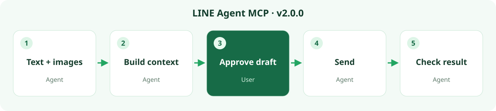

<p align="center"></p>

**English** · [繁體中文](README.md) · [日本語](docs/README.ja.md) · [ภาษาไทย](docs/README.th.md) · [Bahasa Indonesia](docs/README.id.md)

# LINE Agent MCP (SanHsien Maintenance Fork)

<div align="center">

[](https://github.com/SanHsien/line-desktop-mcp/actions/workflows/ci.yml)
[](LICENSE.md)

</div>

This project is a Windows-first maintenance fork of [`bensonmaxai/line-desktop-mcp`](https://github.com/bensonmaxai/line-desktop-mcp), based on the original work by Geoffrey Wang ([`dtwang/line-desktop-mcp`](https://github.com/dtwang/line-desktop-mcp)), licensed under the MIT License. It provides reproducible Windows 11 development gatekeeping, CI workflows, and audited upstream synchronization. The primary Chinese documentation is in [`README.md`](README.md), and maintenance decisions are documented in [`FORK.md`](FORK.md).

Quick bootstrap and verification on Windows:

```powershell
git clone https://github.com/SanHsien/line-desktop-mcp.git
cd line-desktop-mcp
pwsh -NoProfile -File tools\bootstrap_dev.ps1
```

---

**LINE context, including images. Faster reads, less waiting.**

Choose a chat and date range. Let your AI assistant organize the conversation together with available cached images into progress, attachment context and next steps. MCP supplies previews to an image-capable model; original, thumbnail and missing states stay explicit.

[Download v3.0.0](https://github.com/bensonmaxai/line-desktop-mcp/releases/tag/v3.0.0) · [Release notes](docs/releases/v3.0.0.en.md) · [Install](docs/quickstart-windows.md) · [Technical contract](docs/windows-extensions.md)

**LINE Agent MCP**, the Windows community edition maintained by [bensonmaxai](https://github.com/bensonmaxai/line-desktop-mcp), based on [Geoffrey Wang's original project](https://github.com/dtwang/line-desktop-mcp). It connects a local MCP client to a signed-in LINE Desktop. Codex is our everyday client; other local MCP clients can connect too. This project is not affiliated with LINE.

Set `LINE_MCP_EXTENSIONS=1` on Windows for **29 tools**. Without the flag, **five tools** are listed. Their names and input schemas remain. macOS lists the same five names, but reads and sends are unavailable in this release.

**v3.0.0 security update:** Every Windows named-chat GUI operation, including the five defaults, needs CUA and the configured local reader. A private metadata-only check resolves one unique group or existing direct chat without reading messages, then verifies an already-open LINE header. Automatic first-result navigation is disabled. macOS reads/sends refuse before automation. Reply images are cropped to the requested chat; APNG previews contain one frame. GUI history copy restores the prior available clipboard formats when no newer writer intervenes. [Release notes](docs/releases/v3.0.0.en.md) · [Migration](docs/MIGRATING.md#upgrading-to-v300)

## What it does

| Task | What v3.0.0 provides |
| --- | --- |
| Follow up on work | Exact group/direct local history, explicit dates, up to 31 days, pagination and snapshot freshness |
| Understand attachments | On-demand cached image previews, small PCM WAV blocks and explicit media availability |
| Reply to the right source | Full text/sender/time checks and a one-use visual source token |
| Inspect a poll | Read an already-open panel only after binding it to the authorized group |
| Handle client changes | Verified LINE build hashes and distinct process states; unknown builds refuse local reads |
| Reduce waiting | Bounded key search, temporary locator reuse and fewer redundant UI enumerations |

## One conversation, a complete workflow



Ask your assistant to review a named chat and report current progress. It reads the authorized scope, consults separately authorized business sources when needed, and shows the exact draft in the assistant conversation. After you confirm the recipient and content, it sends and checks the result. No separate workbench is required.

Ordinary text drafts are reviewed in Codex. The agent performs visual UI checks; real mentions and shared-content changes still need their specific workflow and approval. Plans are not evidence that an action happened.

## Install and migrate

```powershell
git clone --branch v3.0.0 --depth 1 https://github.com/bensonmaxai/line-desktop-mcp.git
cd line-desktop-mcp
npm ci --ignore-scripts
```

Environment requirements by feature:

| Feature | Environment requirement |
| --- | --- |
| Startup & capabilities | Node.js 24 LTS or newer; tested on Node 24 |
| Local message history | Windows x64, signed-in supported LINE Desktop, Python x64, `cryptography`, Pillow, pinned SQLite3MC DLL |
| Image previews | Uses reader environment above, decoded by Pillow |
| GUI automation & send | Uses reader environment above and compatible CUA driver (AutoHotkey v2 & Windows OCR) |

See [Windows Quickstart](docs/quickstart-windows.md) and [Migration Guide](docs/MIGRATING.md) for complete details.

## Speed and verification

```powershell
npm test
npm run test:python
```

Tests use synthetic messages and simulated UI; they do not access real LINE chats or send live messages.

## Boundaries

- Local cache does not equal full server history. Scope, snapshot timestamp, and pagination are explicit.
- Date filters and poll scheduling use Asia/Taipei (UTC+08:00).
- Local reading accesses read-only memory of the signed-in LINE process for session decoding.
- Currently verified against Windows LINE Desktop 26.4.2.3957.
- OCR and decoding run locally on your device.

## Languages, contribution and license

[Traditional Chinese](README.md) · [English](README.en.md) · [Japanese](docs/README.ja.md) · [Thai](docs/README.th.md) · [Indonesian](docs/README.id.md)

Licensed under the [MIT License](LICENSE.md), preserving original attribution to Geoffrey Wang and bensonmaxai. See [Third-party notices](docs/THIRD_PARTY.md).
