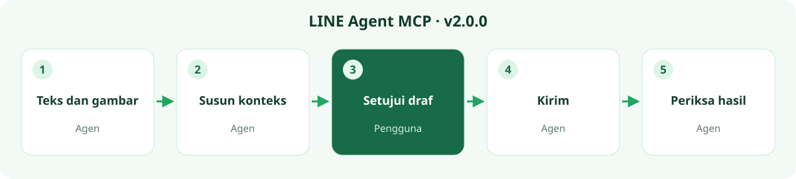

# LINE Agent MCP

**Konteks LINE, termasuk gambar. Pembacaan lebih cepat, waktu tunggu lebih singkat.**

Pilih chat dan rentang tanggal. Biarkan asisten AI menata percakapan bersama gambar yang tersedia di cache lokal menjadi progres, konteks lampiran, dan langkah berikutnya. MCP menyediakan pratinjau untuk model yang mendukung gambar; status gambar asli, thumbnail, dan tidak tersedia tetap dinyatakan dengan jelas.

[繁體中文](../README.md) · [English](README.en.md) · [日本語](README.ja.md) · [ภาษาไทย](README.th.md) · [Bahasa Indonesia](README.id.md)

[Unduh v2.0.0](https://github.com/bensonmaxai/line-desktop-mcp/releases/tag/v2.0.0) · [Catatan rilis](releases/v2.0.0.id.md) · [Instalasi](quickstart-windows.md) · [Peningkatan dan pemulihan](MIGRATING.md) · [Kontrak teknis](windows-extensions.md)

**LINE Agent MCP** adalah edisi komunitas Windows yang dikelola oleh [bensonmaxai](https://github.com/bensonmaxai/line-desktop-mcp), berdasarkan [proyek asli Geoffrey Wang](https://github.com/dtwang/line-desktop-mcp). Proyek ini menghubungkan klien MCP lokal ke LINE Desktop yang sudah masuk. Codex dapat digunakan sebagai klien sehari-hari, dan klien MCP lokal lain juga dapat terhubung. Proyek ini tidak berafiliasi dengan LINE.

Atur `LINE_MCP_EXTENSIONS=1` di Windows untuk menggunakan **29 tools**. Tanpa flag ini, **lima tools** asli tetap tersedia; macOS juga tetap memakai antarmuka asli tersebut.

## Satu percakapan, satu alur kerja lengkap



Minta asisten meninjau chat yang disebutkan dan melaporkan progres saat ini. Asisten membaca cakupan yang diizinkan, memakai sumber bisnis yang diizinkan secara terpisah bila diperlukan, lalu menampilkan draf yang tepat dalam percakapan dengan asisten. Setelah Anda mengonfirmasi penerima dan isi, asisten mengirim dan memeriksa hasilnya. Workbench terpisah tidak diperlukan.

| Tugas | Yang disediakan v2.0.0 |
| --- | --- |
| Menindaklanjuti pekerjaan | Riwayat lokal group/direct yang tepat, tanggal eksplisit, maksimal 31 hari, pagination, dan kesegaran snapshot |
| Memahami lampiran | Pratinjau gambar cache sesuai permintaan, blok PCM WAV kecil, serta ketersediaan media yang dinyatakan jelas |
| Membalas sumber yang tepat | Pemeriksaan teks lengkap/pengirim/waktu dan source token visual sekali pakai |
| Memeriksa polling | Membaca hanya panel yang sudah terbuka setelah diikat ke grup yang diizinkan |
| Menangani perubahan klien | Hash build LINE yang diverifikasi dan status proses terpisah; build yang tidak dikenal menolak pembacaan lokal |
| Mengurangi waktu tunggu | Pencarian kunci berbatas, penggunaan ulang locator sementara, dan lebih sedikit enumerasi UI yang berlebihan |

Draf teks biasa ditinjau di Codex. Agen melakukan pemeriksaan UI secara visual, tetapi mention nyata dan perubahan konten bersama tetap memerlukan alur kerja serta persetujuan khususnya. Rencana bukan bukti bahwa suatu tindakan telah terjadi.

## Instalasi dan peningkatan dari v1.2.0

Jika ingin memakai direktori kerja terpisah, ambil repository yang sama pada tag v2.0.0:

```powershell
git clone --branch v2.0.0 --depth 1 https://github.com/bensonmaxai/line-desktop-mcp.git
cd line-desktop-mcp
npm ci --ignore-scripts
```

Untuk meningkatkan `line-desktop-mcp` v1.2.0 yang sudah ada, cadangkan dahulu konfigurasi klien MCP saat ini. Lalu perbarui checkout yang sama ke v2.0.0, atau ambil v2.0.0 ke direktori source terpisah dengan perintah di atas. Jika memilih yang kedua, arahkan klien MCP ke direktori baru. Akun LINE dan data chat tidak perlu dimigrasikan.

Gunakan Node.js 24 LTS atau lebih baru (teruji: 24.19.0) serta komponen runtime yang dikonfigurasi terpisah untuk tools yang dipakai. Pembacaan lokal memerlukan Windows x64, Python x64, `cryptography` dan Pillow, SQLite3MC DLL yang dipasangi pin, serta `LINE_MCP_PYTHON` / `LINE_MCP_SQLITE3MC_DLL` yang eksplisit. Kedua paket Python wajib untuk semua pembacaan lokal, termasuk mode metadata. Tools UI memakai `LINE_MCP_CUA_DRIVER`, bersama AutoHotkey v2 dan Windows OCR lokal bila diperlukan. Lihat [panduan instalasi](quickstart-windows.md).

Hubungkan ulang dan segarkan tool schema. Identitas MCP dan lima tools asli tetap dipertahankan. Namun, `stage_line_reply` sekarang memerlukan `source` lengkap dan `sourceToken` berumur singkat serta sekali pakai dari tools observasi/konfirmasi sumber. Panggilan lama yang hanya memuat teks ditolak sehingga caller harus diperbarui. `get_line_status.localReader` melaporkan metadata build/proses secara terpisah, bukan kesiapan lengkap dependency/DLL. [Detail peningkatan dan pemulihan](MIGRATING.md)

LINE Agent MCP adalah nama tampilan untuk edisi komunitas Windows ini. v2.0.0 merupakan peningkatan mayor yang meneruskan repository dan rangkaian rilis `line-desktop-mcp`, bukan proyek GitHub baru atau nama MCP yang berbeda.

Rilis ini hanya berjalan melalui stdio lokal. Tidak ada server HTTP/REST atau layanan cloud berbayar, dan `.env` pada current working directory tidak dimuat otomatis; konfigurasi datang dari variabel lingkungan yang diberikan secara eksplisit oleh klien MCP.

Gunakan tag GitHub ini atau release `.tgz`. Proyek ini tidak dipublikasikan ke npm registry dan tidak menyediakan bundel MCPB. Paket lama `line-desktop-mcp@latest` tidak memasang rilis ini.

## Bukti dan batasan


Inti cold reader terukur **17.866 → 4.661 detik**. Pembacaan warm pada koneksi MCP persisten setelah pemeriksaan restart terukur **0.732–0.803 detik**, sebelum overhead tambahan dari klien/model. Ini adalah pengamatan terbatas pada mesin yang sama, bukan jaminan kinerja universal.

Angka 17.866 → 4.661 detik mengukur core Python untuk **riwayat teks** berbatas; angka ini tidak mencakup dekode pratinjau gambar maupun overhead model/GUI. Ini bukan latensi end-to-end untuk pemahaman gambar. Build gate diintegrasikan setelah perbandingan cold, dengan pemeriksaan terpisah sekitar 24 ms; pembacaan warm 0.732–0.803 detik sudah mencakup build gate.

Dua pemeriksaan restart/baca LINE nyata berhasil, dan transport gambar nyata juga didekode secara independen. Ini adalah hasil pemeriksaan terbatas pada mesin yang sama, bukan jaminan kinerja umum.

- Bukti GUI langsung mencakup Windows LINE **26.4.2.3957, Traditional Chinese UI**, CUA Driver 0.23.2. Terjemahan dokumentasi tidak mengesahkan bahasa UI lain.
- Tanggal query dan perencanaan polling memakai **Asia/Taipei, UTC+08:00**.
- Pembacaan lokal memakai akses baca-saja berbatas ke memori proses LINE yang sedang masuk. Operasi berhenti saat akses ditolak atau build belum diverifikasi.
- Catatan cache lokal bukan arsip server lengkap. Pratinjau yang didukung adalah PNG/JPEG, frame pertama GIF/WebP, dan PCM WAV kecil. Media lain yang dikenali mengembalikan metadata. Ini tidak menyiratkan pemutaran atau transkripsi umum.
- Tidak ditemukannya gambar pada cache lokal tidak berarti pemrosesan AI berjalan offline. MCP hanya dapat meneruskan pratinjau cache yang tersedia kepada model yang mendukung gambar.
- Keberadaan teks tidak membuktikan pengiriman ke penerima atau status sudah dibaca. Token mention nyata memerlukan verifikasi visual; pengiriman yang tidak pasti tidak diulang otomatis.
- Dekode dan OCR berjalan secara lokal. Konten yang dikembalikan mengikuti kebijakan penanganan data klien AI yang dipilih.

Untuk verifikasi sintetis, jalankan `npm test` dan `npm run test:python` dengan Python yang telah dikonfigurasi. [Kontrak tools dan verifikasi terperinci](windows-extensions.md)

[Pemilihan bahasa dan sumber resmi](LANGUAGES.md) · [Laporkan issue](https://github.com/bensonmaxai/line-desktop-mcp/issues) · [Lisensi MIT](../LICENSE.md) · [Catatan pihak ketiga](THIRD_PARTY.md)

Sampul adalah ilustrasi konsep yang dihasilkan AI. Grafik alur kerja/kinerja dibuat dengan kode, bukan tangkapan layar chat nyata atau aset LINE resmi.
