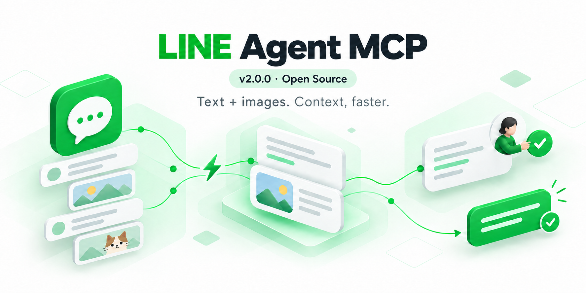
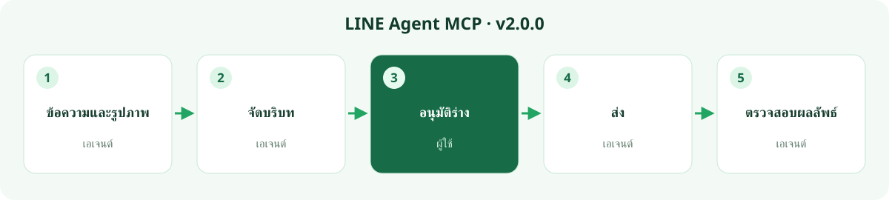
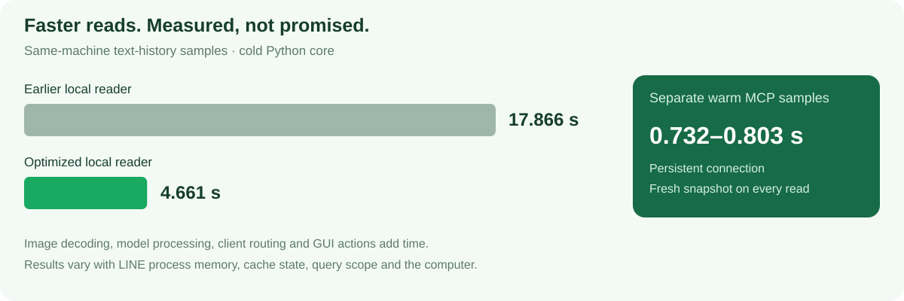

# LINE Agent MCP

**บริบท LINE ที่รวมรูปภาพด้วย อ่านเร็วขึ้น และรอน้อยลง**

เลือกแชตและช่วงวันที่ แล้วให้ผู้ช่วย AI จัดระเบียบบทสนทนาร่วมกับรูปภาพที่มีอยู่ในแคชภายในเครื่อง เพื่อสรุปความคืบหน้า บริบทของไฟล์แนบ และขั้นตอนถัดไป MCP จะส่งตัวอย่างภาพให้โมเดลที่รองรับภาพ โดยยังระบุสถานะไฟล์ต้นฉบับ ภาพขนาดย่อ และกรณีที่ไม่พบอย่างชัดเจน

[繁體中文](../README.md) · [English](README.en.md) · [日本語](README.ja.md) · [ภาษาไทย](README.th.md) · [Bahasa Indonesia](README.id.md)

[ดาวน์โหลด v2.0.0](https://github.com/bensonmaxai/line-desktop-mcp/releases/tag/v2.0.0) · [บันทึกการอัปเดต](releases/v2.0.0.th.md) · [การติดตั้ง](quickstart-windows.md) · [การอัปเกรดและย้อนกลับ](MIGRATING.md) · [ข้อกำหนดทางเทคนิค](windows-extensions.md)

**LINE Agent MCP** คือรุ่นชุมชนสำหรับ Windows ที่ดูแลโดย [bensonmaxai](https://github.com/bensonmaxai/line-desktop-mcp) และพัฒนาต่อยอดจาก [โครงการต้นฉบับของ Geoffrey Wang](https://github.com/dtwang/line-desktop-mcp) โครงการนี้เชื่อม MCP client ภายในเครื่องกับ LINE Desktop ที่ลงชื่อเข้าใช้แล้ว ใช้ Codex เป็น client ประจำได้ และ local MCP client อื่นก็เชื่อมต่อได้เช่นกัน โครงการนี้ไม่มีความเกี่ยวข้องกับ LINE อย่างเป็นทางการ

บน Windows ให้ตั้งค่า `LINE_MCP_EXTENSIONS=1` เพื่อใช้ **29 tools** หากไม่ตั้งค่านี้ จะคง **5 tools** เดิมไว้ และ macOS ก็ยังคงอินเทอร์เฟซเดิม

## หนึ่งบทสนทนา ครบหนึ่งเวิร์กโฟลว์



ขอให้ผู้ช่วยตรวจสอบแชตที่ระบุชื่อและรายงานความคืบหน้าปัจจุบัน ผู้ช่วยจะอ่านขอบเขตที่ได้รับอนุญาต อ้างอิงแหล่งข้อมูลธุรกิจที่อนุญาตแยกต่างหากเมื่อจำเป็น และแสดงร่างข้อความที่ตรงตามจริงในบทสนทนากับผู้ช่วย เมื่อคุณยืนยันผู้รับและเนื้อหาแล้ว จึงส่งและตรวจสอบผลลัพธ์ได้ โดยไม่ต้องใช้ workbench แยกต่างหาก

| งาน | สิ่งที่ v2.0.0 ให้ได้ |
| --- | --- |
| ติดตามงาน | ประวัติภายในเครื่องของแชตกลุ่ม/แชตส่วนตัวที่ตรงกัน วันที่ที่ระบุชัดเจน สูงสุด 31 วัน การแบ่งหน้า และความใหม่ของ snapshot |
| ทำความเข้าใจไฟล์แนบ | ตัวอย่างภาพจากแคชเมื่อต้องการ บล็อก PCM WAV ขนาดเล็ก และสถานะความพร้อมของสื่อที่ระบุชัดเจน |
| ตอบกลับต้นทางที่ถูกต้อง | ตรวจสอบข้อความเต็ม ผู้ส่ง และเวลา พร้อม source token แบบเห็นภาพที่ใช้ได้ครั้งเดียว |
| ตรวจสอบโพล | อ่านเฉพาะแผงที่เปิดอยู่แล้ว หลังจากผูกกับกลุ่มที่ได้รับอนุญาต |
| รับมือเมื่อ client เปลี่ยนแปลง | แฮช build ของ LINE ที่ตรวจสอบแล้ว และสถานะ process ที่แยกกัน build ที่ไม่รู้จักจะปฏิเสธการอ่านในเครื่อง |
| ลดเวลารอ | ค้นหาคีย์แบบมีขอบเขต ใช้ locator ชั่วคราวซ้ำ และลดการไล่ดู UI ที่ซ้ำซ้อน |

ร่างข้อความธรรมดาจะได้รับการตรวจทานใน Codex เอเจนต์ทำการตรวจสอบ UI ด้วยภาพ แต่การ mention จริงและการเปลี่ยนแปลงเนื้อหาที่แชร์ยังต้องใช้เวิร์กโฟลว์และการอนุมัติของแต่ละงาน แผนงานไม่ใช่หลักฐานว่าการกระทำเกิดขึ้นแล้ว

## การติดตั้งและการอัปเกรดจาก v1.2.0

หากต้องการใช้ไดเรกทอรีทำงานแยกต่างหาก ให้รับ repository เดิมที่ tag v2.0.0:

```powershell
git clone --branch v2.0.0 --depth 1 https://github.com/bensonmaxai/line-desktop-mcp.git
cd line-desktop-mcp
npm ci --ignore-scripts
```

หากอัปเกรด `line-desktop-mcp` v1.2.0 ที่มีอยู่ ให้สำรองการตั้งค่า MCP client ปัจจุบันก่อน จากนั้นอัปเดต checkout เดิมเป็น v2.0.0 หรือรับ v2.0.0 ลงในไดเรกทอรี source แยกต่างหากด้วยคำสั่งข้างต้น หากเลือกอย่างหลัง ให้ชี้ MCP client ไปยังไดเรกทอรีใหม่ บัญชี LINE และข้อมูลแชตไม่ต้องย้าย

ใช้ Node.js 24 LTS ขึ้นไป (ทดสอบแล้ว: 24.19.0) และส่วนประกอบ runtime ที่ตั้งค่าแยกต่างหากตาม tools ที่ต้องใช้ การอ่านในเครื่องต้องใช้ Windows x64, Python x64, `cryptography` และ Pillow, SQLite3MC DLL ที่ตรึงไว้ และ `LINE_MCP_PYTHON` / `LINE_MCP_SQLITE3MC_DLL` ที่ระบุอย่างชัดเจน ต้องมี Python packages ทั้งสองสำหรับ local read ทุกแบบ รวมถึง metadata mode เครื่องมือ UI ใช้ `LINE_MCP_CUA_DRIVER` พร้อม AutoHotkey v2 และ Windows OCR ภายในเครื่องเมื่อจำเป็น ดูรายละเอียดใน[คู่มือการติดตั้ง](quickstart-windows.md)

เชื่อมต่อใหม่และรีเฟรช tool schema ตัวระบุ MCP และ 5 tools เดิมยังคงอยู่ แต่ `stage_line_reply` ต้องใช้ `source` แบบเต็มและ `sourceToken` แบบอายุสั้น ใช้ได้ครั้งเดียว จาก tools สำหรับสังเกต/ยืนยันต้นทาง จึงต้องแก้ไข caller เพราะการเรียกแบบข้อความอย่างเดียวเดิมจะถูกปฏิเสธ `get_line_status.localReader` รายงาน metadata ของ build/process แยกต่างหาก ไม่ใช่สถานะความพร้อมครบถ้วนของ dependency/DLL [รายละเอียดการอัปเกรดและย้อนกลับ](MIGRATING.md)

LINE Agent MCP เป็นชื่อที่ใช้แสดงของรุ่นชุมชน Windows นี้ v2.0.0 คือการอัปเกรด major ของ repository และลำดับการเผยแพร่ `line-desktop-mcp` เดิม ไม่ใช่โครงการ GitHub ใหม่หรือชื่อ MCP อื่น

รุ่นนี้ทำงานผ่าน local stdio เท่านั้น ไม่มี HTTP/REST server หรือบริการ cloud แบบมีค่าใช้จ่าย และจะไม่โหลด `.env` ใน current working directory โดยอัตโนมัติ การตั้งค่ามาจาก environment variables ที่ MCP client ส่งมาอย่างชัดเจน

ใช้ GitHub tag นี้หรือ release `.tgz` โครงการนี้ไม่ได้เผยแพร่บน npm registry และไม่มี MCPB bundle แพ็กเกจเก่า `line-desktop-mcp@latest` จะไม่ติดตั้งรุ่นนี้

## หลักฐานและขอบเขต



แกน cold reader วัดได้ **17.866 → 4.661 วินาที** การอ่านแบบ warm ผ่าน persistent MCP หลังตรวจสอบการเริ่มใหม่วัดได้ **0.732–0.803 วินาที** โดยยังไม่รวม client/model overhead เพิ่มเติม ตัวเลขนี้เป็นการสังเกตแบบมีขอบเขตบนเครื่องเดียวกัน ไม่ใช่การรับประกันประสิทธิภาพสำหรับทุกสภาพแวดล้อม

ค่า 17.866 → 4.661 วินาทีเป็นการวัด Python core ของ **ประวัติข้อความ** ตามขอบเขต ไม่รวมการถอดรหัส image preview หรือ overhead ของ model/GUI จึงไม่ใช่ latency แบบ end-to-end สำหรับการทำความเข้าใจภาพ build gate ถูกเพิ่มหลัง cold comparison และการตรวจแยกใช้เวลาประมาณ 24 ms; ค่า warm 0.732–0.803 วินาทีรวม build gate แล้ว

มีการตรวจสอบการเริ่ม LINE ใหม่และการอ่านจริง 2 ครั้งผ่าน และมีการถอดรหัสการส่งภาพจริงอย่างอิสระแล้ว ผลเหล่านี้เป็นการตรวจสอบบนเครื่องเดียวกันในขอบเขตจำกัด ไม่ใช่การรับประกันประสิทธิภาพทั่วไป

- หลักฐาน GUI จริงครอบคลุม Windows LINE **26.4.2.3957, Traditional Chinese UI**, CUA Driver 0.23.2 การแปลเอกสารไม่ได้รับรองภาษา UI อื่น
- วันที่ของ query และการวางแผนโพลใช้ **Asia/Taipei, UTC+08:00**
- การอ่านในเครื่องใช้การเข้าถึงแบบอ่านอย่างเดียวที่มีขอบเขตต่อหน่วยความจำ process ของ LINE ที่ลงชื่อเข้าใช้ การเข้าถึงที่ถูกปฏิเสธหรือ build ที่ไม่ผ่านการตรวจสอบจะหยุดการทำงาน
- ข้อมูลใน local cache ไม่ใช่คลังข้อมูล server ทั้งหมด preview ที่รองรับคือ PNG/JPEG, เฟรมแรกของ GIF/WebP และ PCM WAV ขนาดเล็ก สื่อที่รู้จักชนิดอื่นจะคืน metadata ไม่ได้หมายความว่ามีการเล่นหรือถอดเสียงสำหรับทุกชนิด
- การไม่พบรูปภาพใน local cache ไม่ได้หมายความว่าการประมวลผล AI ทำงานแบบออฟไลน์ MCP จะส่งได้เฉพาะ preview จากแคชที่มีอยู่ให้โมเดลที่รองรับภาพ
- การมีข้อความไม่ได้พิสูจน์ว่าส่งถึงหรือถูกอ่านโดยผู้รับ mention token จริงต้องตรวจสอบด้วยภาพ และจะไม่ส่งซ้ำอัตโนมัติเมื่อผลการส่งไม่แน่นอน
- การถอดรหัสและ OCR ทำงานภายในเครื่อง เนื้อหาที่ส่งกลับอยู่ภายใต้นโยบายการจัดการข้อมูลของ AI client ที่เลือกใช้

สำหรับการตรวจสอบแบบสังเคราะห์ ให้รัน `npm test` และ `npm run test:python` พร้อม Python ที่ตั้งค่าแล้ว [ข้อกำหนดและการตรวจสอบโดยละเอียด](windows-extensions.md)

[การเลือกภาษาและแหล่งข้อมูลทางการ](LANGUAGES.md) · [รายงานปัญหา](https://github.com/bensonmaxai/line-desktop-mcp/issues) · [MIT license](../LICENSE.md) · [หมายเหตุเกี่ยวกับ third party](THIRD_PARTY.md)

ภาพปกเป็นภาพแนวคิดที่สร้างโดย AI กราฟิกเวิร์กโฟลว์/ประสิทธิภาพสร้างจากโค้ด ไม่ใช่ภาพหน้าจอแชตจริงหรือทรัพย์สิน LINE อย่างเป็นทางการ
