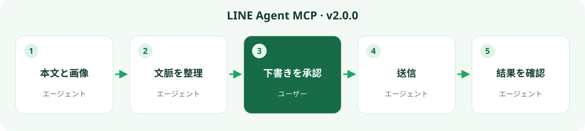

# v2.0.0 — 画像も含めた LINE の文脈。より速く読み取る。

[すべての言語](README.md) · [ダウンロード](https://github.com/bensonmaxai/line-desktop-mcp/releases/tag/v2.0.0) · [インストール](../quickstart-windows.md)

**テキストと画像を同じ文脈に置き、待ち時間を減らします。** チャットと日付範囲を選択すると、リーダーは範囲を限定した会話テキストと、要求時には利用可能なキャッシュ画像プレビューを画像対応 AI モデルへ返します。アシスタントは進捗と次の対応を整理し、送信前に確認用の下書きを表示できます。業務ファイルやほかのサービスには、それぞれ承認されたデータソースまたはコネクターが必要です。

本リリースでは、Windows 向けに 29 個のオプトインツールを提供します。主な進化は、画像を含む文脈と高速なローカル読み取りです。以下の測定値とメディア制限は、実際に検証した範囲を示します。

## v1.2.0 からのアップグレード

**既存のリポジトリ内でアップグレードします。** 最初に現在の MCP クライアント設定をバックアップしてください。次に既存の `line-desktop-mcp` チェックアウトを v2.0.0 に更新するか、別のソースディレクトリへ v2.0.0 を取得してクライアントの接続先を変更します。Python／SQLite3MC リーダーの依存関係を追加し、再接続してツールスキーマを更新してください。MCP の識別子は `line-desktop-mcp` のままで、LINE アカウントとチャットデータの移行は不要です。[アップグレードとロールバック](../MIGRATING.md)

`stage_line_reply` には、ソースの観察／確認ツールで得る完全な `source` と、短期間有効で 1 回限りの `sourceToken` が必要になりました。旧来のテキストのみの返信呼び出しは拒否されるため、呼び出し側を更新してください。`get_line_status` には独立した `localReader` のビルド／プロセスメタデータが追加されています。UI バックエンドが欠けていてもこの結果は消えませんが、ステータスは Python 依存関係や DLL の準備完了を示すものではありません。

LINE Agent MCP はこの Windows 向けコミュニティ版の表示名です。v2.0.0 は既存のリポジトリを継続し、5 個の既存デフォルトツールと macOS のインターフェースを維持します。オプトインの返信スキーマ変更にはメジャーバージョンが必要です。

## 新機能

- **範囲を限定したローカル履歴：** 正確に 1 つのグループまたは個人チャット、明示的な日付、最大 31 日、リテラル検索、ソース参照、キーセットページ送り、新しい DB/WAL スナップショット。GUI 比較は任意で、要求ごとに 1 回だけ行います。
- **必要なときのメディア：** PNG/JPEG 画像、範囲を限定した GIF/WebP の先頭フレームプレビュー、検証済みの小さな PCM WAV ブロック。原画像／サムネイル、欠落、保留、未対応の状態は明示したままです。
- **より強い返信／投票ワークフロー：** ステージ前に引用元の完全なソースと現在のピクセルを確認します。すでに開かれた投票は、承認済みグループにバインドした後でのみ読み取ります。計画は送信、公開、実際のメンショントークン作成を行いません。
- **互換性と速度：** 検証済み LINE ビルドハッシュ、プロセスインスタンス診断、範囲を限定したキー検索、短命ロケーターの再利用、冗長な UI 列挙の削減。未知の LINE ビルドはフェイルクローズします。
- **5 言語の文書：** 繁体字中国語、英語、日本語、タイ語、インドネシア語。新しいカバーと各言語のワークフローグラフィックを用意しています。

## 保守者の Windows マシンでの測定

コールドリーダーコアは **17.866 秒から 4.661 秒**へ改善しました。再起動確認後の永続的な MCP 接続でのウォーム読み取りは **0.732–0.803 秒**でした。クライアント／モデルのオーバーヘッドは別にかかるため、これは普遍的な遅延保証ではありません。

17.866 → 4.661 秒は、範囲を限定した**テキスト履歴**の Python コア計測であり、画像プレビューのデコード、モデル、GUI のオーバーヘッドは含みません。画像理解を含むエンドツーエンドの待ち時間ではありません。ビルドゲートはコールド比較後に統合され、個別チェックは約 24 ms でした。ウォームの 0.732–0.803 秒にはビルドゲートが含まれます。

実際の LINE 再起動を 2 回行った後、範囲を限定した読み取りに成功しました。実際にキャッシュされた 5 枚の画像は MCP 転送と独立したデコード確認を通過しました。より広い GIF/WebP/WAV のケースは合成テストで扱います。ほかのライブワークフローにはそれぞれ別の根拠があり、すべてのアダプターまたはロケールを認証するものではありません。

## 要件と制限

サーバーには Node.js 24 LTS 以降（検証済み: 24.19.0）が必要です。

ローカル読み取りには Windows x64、許可リストにあるログイン済み LINE ビルド、明示的な `LINE_MCP_PYTHON` と `LINE_MCP_SQLITE3MC_DLL`、`cryptography` と Pillow を含む Python 依存関係が必要です。Pillow はプレビューだけでなく、メタデータのみの要求を含むすべてのローカルリーダー利用に必要です。UI ツールは別途 `LINE_MCP_CUA_DRIVER` を使用します。起動時に依存関係をインストールしたり、チャットを読み取ったりすることはありません。ローカル読み取りはログイン中の LINE プロセスメモリに対する範囲を限定した読み取り専用アクセスを使用し、アクセスが拒否された場合は操作を停止します。

サーバーはローカル stdio 専用で、HTTP/REST サービスや有料クラウドサービスではありません。カレントディレクトリの `.env` を自動で読み込まず、設定は MCP クライアントが明示的に渡す環境変数から受け取ります。

ライブ GUI の根拠は **LINE 26.4.2.3957、繁体字中国語 UI** を対象にしています。ほかの UI 言語はライブ認証されていません。クエリ日付と投票計画は **Asia/Taipei、UTC+08:00** を使用します。ローカルキャッシュは完全なサーバーアーカイブではなく、汎用の音声／動画再生、文字起こし、受信者通知の保証はありません。ローカルに画像が見つからないことは AI 処理がオフラインであることを意味せず、画像対応モデルに渡せるのは利用可能なキャッシュプレビューだけです。デコード／OCR はローカルで実行され、返されたツール内容は選択した AI クライアントのポリシーに従って処理されます。

この GitHub ソースタグまたはリリース `.tgz` を使用してください。npm レジストリまたは MCPB のリリースは提供しません。旧い `line-desktop-mcp@latest` パッケージではこのプロジェクトはインストールされません。[完全な仕様と検証](../windows-extensions.md)
