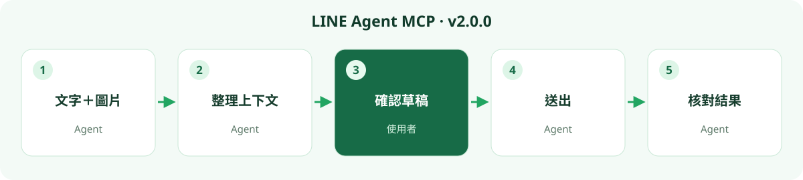

# v2.0.0 — 上下文連圖片一起整理，讀取得更快

[全部語言](README.md) · [下載](https://github.com/bensonmaxai/line-desktop-mcp/releases/tag/v2.0.0) · [安裝指南](../quickstart-windows.md)

**文字與圖片放進同一段上下文，減少等待。** 指定聊天室與日期後，讀取器提供範圍內的文字，以及需要時才取得的快取圖片預覽，讓支援影像的 AI 模型一起整理進度、附件線索與待辦。後續可在 Codex 確認完整草稿，再送出並核對；其他文件或服務仍需要各自的資料來源與授權。

本版提供 29 個可選用的 Windows 工具，兩個重點是「上下文包含圖片」與「快速本機讀取」。下方列出實際量測條件與媒體限制。

## 從 v1.2.0 升級

**啟用 `LINE_MCP_EXTENSIONS=1` 的串接有不相容變更。** 請重新連線 MCP，刷新工具 schema。`stage_line_reply` 現在必須提供完整 `source`，以及透過來源觀察／確認工具取得、短效且只能使用一次的 `sourceToken`；舊的純文字引用呼叫會被拒絕。`get_line_status` 新增獨立的 `localReader` 版本／程序資訊，介面後端不可用時仍會保留該結果，但不代表 Python 依賴與 DLL 已全部就緒。

LINE Agent MCP 是此 Windows 社群版的展示名稱；v2.0.0 延續原本儲存庫與 MCP 名稱 `line-desktop-mcp`，保留 5 個預設工具及 macOS 介面。LINE 帳號與聊天資料不用搬移。[升級與回退](../MIGRATING.md)

## 新增與改善

- **有範圍的本機歷史：** 限指定群組或個人對話、明確日期與最多 31 天，支援文字搜尋、來源參考、分頁和新的 DB/WAL 快照。GUI 比對為選用，每次要求只做一次。
- **需要時才讀媒體：** 支援 PNG/JPEG、受限的 GIF/WebP 首幀預覽與小型 PCM WAV；原圖／縮圖、缺失、延後與不支援狀態都會明示。
- **引用與投票更可靠：** 暫存引用前核對完整來源及目前畫面；投票面板必須先與已授權群組綁定。計畫工具不會傳送、發布或建立真實提及 token。
- **相容性與速度：** 檢查 LINE 執行檔雜湊與程序實例，加上有界的金鑰搜尋、短期定位資訊及減少重複 UI 查詢。未知 LINE 版本停止讀取。
- **五語圖文說明：** 繁中、英文、日文、泰文、印尼文，共用新版封面與各語言流程圖。

## 維護者電腦的實測

冷讀核心從 **17.866 秒降至 4.661 秒**；重啟驗收後，持續 MCP 連線的暖讀約 **0.732–0.803 秒**。客戶端與模型處理另有耗時，這不是所有電腦的速度保證。

兩次實際 LINE 重啟後均成功讀取指定範圍，5 張實際快取圖片通過 MCP 傳輸與獨立解碼檢查；其他 GIF/WebP/WAV 情境以合成測試覆蓋。各類實機操作有各自證據，不能推成所有 adapter 與語系都已通過。

## 需求與界線

Node.js 需 24 或更新版本；本版測試使用 24.19.0。

本機讀取需要 Windows x64、已登入且在允許清單內的 LINE、明確的 `LINE_MCP_PYTHON` 與 `LINE_MCP_SQLITE3MC_DLL`，以及 Python 依賴。UI 工具另用 `LINE_MCP_CUA_DRIVER`。啟動不會安裝依賴或讀取聊天；讀取會對已登入 LINE 程序進行受限、唯讀的記憶體存取，遭拒便停止。

目前實機 GUI 證據涵蓋 **LINE 26.4.2.3957、繁體中文介面**；其他 UI 語言尚未實測。查詢日期與投票計畫固定使用 **Asia/Taipei，UTC+08:00**。本機快取不等於完整伺服器歷史，沒有通用音訊／影片播放、轉錄或對方收到通知的保證。解碼與 OCR 在本機進行，工具回傳內容仍依所選 AI 客戶端的資料政策處理。

請用本 GitHub tag 或 release `.tgz` 安裝。本專案尚未發布至 npm registry，也未提供 MCPB；舊套件 `line-desktop-mcp@latest` 不會安裝本專案。[完整工具契約與驗證](../windows-extensions.md)

上述速度是文字歷史樣本，不是包含圖片判讀的端到端延遲。本機讀取須同時安裝 `cryptography` 與 Pillow。本版僅提供 stdio，使用 MCP 客戶端明確設定的環境變數；移除 HTTP／REST 與自動載入啟動目錄 `.env` 的行為。
