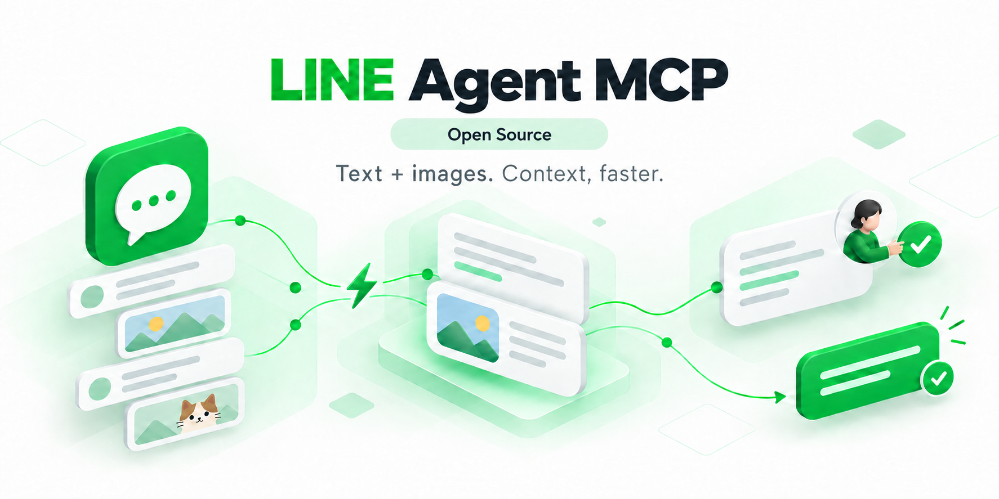

# v3.0.0 — Verify the chat before acting

[All languages](README.md) · [Download](https://github.com/bensonmaxai/line-desktop-mcp/releases/tag/v3.0.0) · [Install](../quickstart-windows.md) · [Migration and rollback](../MIGRATING.md#upgrading-to-v300)

This security release tightens the chat boundary for GUI reads, drafts and sends, and narrows returned media. The MCP name remains `line-desktop-mcp`, with 29 opt-in Windows tools or five default tools. The five default names, order and input schemas remain; their descriptions now report platform availability. It is a major version because Windows GUI prerequisites and macOS availability change.

## Compatibility changes

- Every Windows named-chat GUI path, including the five default tools, requires CUA and the configured Python/SQLite3MC local reader. Python needs both `cryptography` and Pillow. Status/capability checks alone do not prove these components are ready.
- A private metadata-only snapshot checks the complete bounded set of groups and existing direct chats before accessing LINE windows. It reads no messages or media. Duplicate or visually confusable names, incomplete inventories and unavailable identity evidence refuse the action; chat kind cannot hide a cross-kind collision.
- Open the intended chat manually or through a separately verified guided UI workflow first. `open_line_chat` verifies that already-open chat; it no longer selects the first search result. Current header proof is still required after local identity resolution.
- macOS continues to list five default tools, but history reads and sends return `LINE_CHAT_VERIFICATION_UNAVAILABLE` before automation. This release does not provide a macOS chat verifier.

## Security fixes

- **Reply screenshots:** source selection and post-Reply fallback return only the verified chat region. Crop bounds, PNG dimensions and fingerprints are checked; public coordinates start at the cropped image origin.
- **GUI chat identity:** legacy and extension operations share verification. Fresh opaque chat references and kinds bind confirmation tokens; stale or changed identities refuse. Post-input drift reports uncertainty with `operationMayHaveCompleted:true`, without automatic resend.
- **Clipboard handling:** GUI history copy captures prior available formats, verifies the LINE clipboard owner and sequence, and restores before returning. A newer writer is preserved and the read refuses. Clipboard History and external observers remain outside this guarantee.
- **APNG previews:** animated PNG follows the existing bounded first-frame derivation instead of returning the full animation. Static PNG/JPEG bytes remain unchanged.
- **Deep JSON metadata:** excessive nesting no longer aborts an entire history page. The malformed metadata becomes unknown while ordinary text and valid neighboring rows remain available.

## Verification and limits

The candidate was verified with synthetic Node/Python regression tests, the native pinned SQLite3MC engine, and native AHK syntax parsing. Tests exercise ambiguous names, stale tokens, clipboard guards, crop failures, APNG and deep JSON, with normal controls. The release download includes checksums; the GitHub release body records the final clean-package test counts.

This security release did not repeat live LINE chat reads, clipboard interaction or sends. Earlier v2.0.0 performance and live-flow observations are historical evidence, not a fresh v3.0.0 benchmark. Local identity snapshots and UI pixels are not an atomic database-ID binding; concurrent changes between observations remain a limit. Returned tool content is still processed by the chosen AI client/model under its settings.

## Install and rollback

Use the GitHub `v3.0.0` source tag or attached `.tgz`; no npm-registry or MCPB release is provided. Extract to a new local directory and run `npm ci --ignore-scripts`. Use Node.js 24+ and explicit `LINE_MCP_PYTHON`, `LINE_MCP_SQLITE3MC_DLL` and `LINE_MCP_CUA_DRIVER` paths; configure AutoHotkey v2 for applicable GUI paths. Reconnect the MCP client and refresh schemas. Keep the prior package and launcher to roll back; reverting also restores the older security behavior. LINE account/chat data need no migration.

The server remains local stdio only. Startup does not install dependencies, read chats or load a cwd `.env`. Date scopes remain Asia/Taipei (`UTC+08:00`), at most 31 days. Local caches are not complete server archives. [Full contract](../windows-extensions.md)
